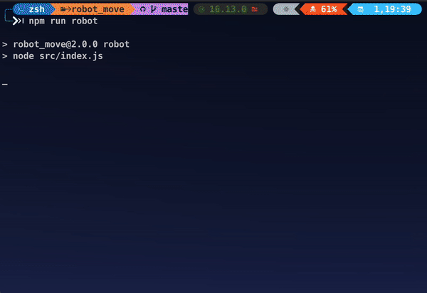

# Fantastic Motion Robot


> Move the robot on the checkerboard

NodeJs terminal example:

[]()


## :cloud: Installation

```sh
$ git clone https://github.com/amir22hr/robot_move.git
$ cd robot_move
$ npm install
```


## :question: Get Help

**For run game** :rocket: 

    $ npm run robot

**Commends :memo:**

 - exit
 - menu
 - move
 - right
 - left
 - x-y-up
 - x-y-down
 - x-y-right
 - x-y-left

## :clipboard: Quick Example

```txt
# Go to position axis x - axis y - Direction
$ 5-3-up
or
$ 4-1-left

# Move the character forward
$ move

# Character clockwise rotation
$ right

# Character counterclockwise rotation
$ left
```