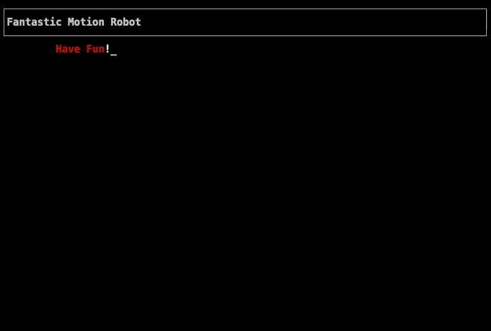

# Fantastic Motion Robot


> Move the robot on the checkerboard

NodeJs terminal example:

[]()


## :cloud: Installation

```sh
$ git clone https://github.com/amir22hr/robot_move.git
$ cd robot_move
$ npm install
```


## :question: Get Help

**For run game** :rocket: 

    $ npm run robot

**Commends :memo:**

 - exit
 - menu
 - move
 - right
 - left
 - x-y-up
 - x-y-down
 - x-y-right
 - x-y-left

## :clipboard: Quick Example

```txt
# Go to position axis x - axis y - Direction
$ 5-3-up
or
$ 4-1-left

# Move the character forward
$ move

# Character clockwise rotation
$ right

# Character counterclockwise rotation
$ left
```

## :hammer_and_wrench: Changelog

### v2.1.0 - 02 January 2022
- Improve program structure
- Add last_position feature

### v2.0.0 - 01 January 2022
- Rewrite the project
- Use terminal-kit package for full program coverage
- Fully responsive
- Use data storage

### v1.0.0 - 26 December 2021
- create project core